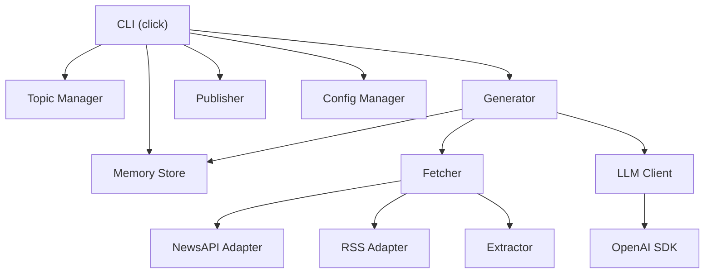
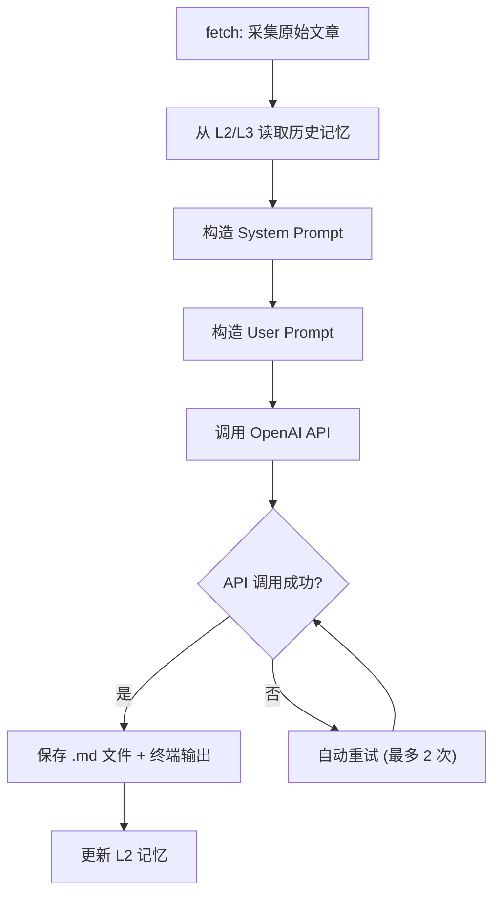

# NewsWeaver – 可定制 AI 资讯 Agent（CLI 版）

> **版本**：v1.0  
> **状态**：Draft  
> **创建日期**：2026-06-08  
> **维护者**：NewsWeaver Team  
> **文档密级**：内部公开  
> **开发模式**：CLI 先行，所有功能通过命令行验证，不使用数据库，不实现前端及自动发布。

---

## 目录

- [1. 产品概述](#1-产品概述)
- [2. 目标用户与场景](#2-目标用户与场景)
- [3. 技术架构](#3-技术架构)
- [4. 功能需求](#4-功能需求)
- [5. 非功能需求](#5-非功能需求)
- [6. 数据结构设计](#6-数据结构设计)
- [7. CLI 命令规格](#7-cli-命令规格)
- [8. 交付计划](#8-交付计划)
- [9. 风险分析](#9-风险分析)
- [10. 附录](#10-附录)

---

## 1. 产品概述

### 1.1 产品定位

NewsWeaver 是一个基于 OpenAI API（兼容范式）的**资讯智能体**，面向需要高效采集、分析和总结特定领域新闻的开发者与内容创作者。用户通过 CLI 配置关注主题后，Agent 自动完成"搜索 → 分析 → 串联 → 对比历史记忆 → 生成报道"的全链路流程。

### 1.2 核心价值主张

| 价值维度 | 描述 |
|---------|------|
| **信息降噪** | 从海量资讯中自动提取关键信息，过滤噪声 |
| **趋势洞察** | 通过三层记忆机制（瞬时 / 近期 / 长期），自动对比历史趋势 |
| **零基础设施** | 纯 JSON 文件存储，无需数据库，开箱即用 |
| **可扩展架构** | 预留社交媒体发布接口、支持自定义信源接入 |

### 1.3 核心流程

```
用户配置主题 → 搜索外部资讯 → 正文提取与清洗 → OpenAI 分析生成 → 结合三层记忆对比 → 输出 Markdown 报道 → (预留) 手动触发发布
```

### 1.4 关键约束

- **运行模式**：CLI 单进程，无后台服务
- **存储方案**：JSON 文件，无外部数据库依赖
- **LLM 依赖**：OpenAI API 兼容服务（`base_url` 可配置）
- **发布能力**：仅提供接口定义与模拟实现，不集成真实平台 API

---

## 2. 目标用户与场景

### 2.1 用户画像

| 画像 | 描述 | 典型场景 |
|------|------|---------|
| **技术开发者** | 关注特定技术领域动态，希望自动化采集与总结 | 每日跟踪 AI/芯片/云计算等领域最新进展 |
| **内容创作者** | 需要新闻素材作为创作输入，手动发布到社交平台 | 将 AI 生成的新闻摘要作为公众号/Twitter 素材 |
| **行业研究员** | 需要对比历史新闻趋势，发现行业变化规律 | 追踪新能源行业 90 天舆情走向 |

### 2.2 用户旅程

```
[首次使用]
  1. pip install newsweaver
  2. newsweaver config set --key llm.api_key --value sk-xxx
  3. newsweaver topic add --name "AI芯片" --keywords "NVIDIA,AMD"
  4. newsweaver generate --topic "AI芯片"
  → 终端输出新闻报道 + 文件保存

[日常使用]
  1. newsweaver generate --topic "AI芯片"
  → 自动对比历史记忆，生成含趋势分析的新闻报道
  
[定期维护]
  1. newsweaver memory compact --topic "AI芯片"
  → 将近期记忆压缩归档至长期趋势记忆
```

---

## 3. 技术架构

### 3.1 技术选型

| 层级 | 选型 | 版本要求 | 说明 |
|------|------|---------|------|
| 运行环境 | Python | ≥ 3.10 | 使用 `match`/`case` 等新语法特性 |
| CLI 框架 | `click` | ≥ 8.0 | 支持命令组、参数验证、自动补全 |
| HTTP 请求 | `requests` | ≥ 2.28 | 新闻 API 调用 |
| RSS 解析 | `feedparser` | ≥ 6.0 | RSS 源解析 |
| 正文提取 | `newspaper3k` / `readability-lxml` | — | 正文提取失败时降级使用摘要字段 |
| LLM 调用 | `openai` SDK | ≥ 1.0 | `base_url` 可配置，兼容任何 OpenAI 范式服务 |
| 记忆存储 | JSON 文件 | — | 按主题分文件存储 |
| 配置管理 | JSON 文件 | — | 全局单一配置文件 |

### 3.2 项目结构

```
newsweaver/
├── pyproject.toml              # 项目元数据与依赖声明
├── setup.cfg                   # 兼容配置
├── README.md
├── src/
│   └── newsweaver/
│       ├── __init__.py
│       ├── cli.py              # CLI 入口（click 命令组）
│       ├── config.py           # 配置管理（读写 config.json）
│       ├── topic.py            # 主题管理命令
│       ├── fetcher/
│       │   ├── __init__.py
│       │   ├── base.py         # 信源抽象基类
│       │   ├── newsapi.py      # NewsAPI 适配器
│       │   └── rss.py          # RSS 适配器（含 Google News RSS 回退）
│       ├── extractor.py        # 正文提取与清洗
│       ├── llm/
│       │   ├── __init__.py
│       │   ├── client.py       # OpenAI API 封装（含重试逻辑）
│       │   └── prompts.py      # Prompt 模板管理
│       ├── memory/
│       │   ├── __init__.py
│       │   ├── store.py        # 记忆存储引擎（L2/L3 JSON 读写）
│       │   └── compact.py      # 记忆压缩（L2 → L3 聚合）
│       ├── generator.py        # 新闻生成主流程编排
│       ├── publisher.py        # 社交媒体发布接口（预留）
│       └── utils.py            # 工具函数（文件锁、日志等）
├── output/                     # 生成的新闻报道输出目录
└── tests/
    ├── test_config.py
    ├── test_fetcher.py
    ├── test_memory.py
    └── test_generator.py
```

### 3.3 依赖关系图



---

## 4. 功能需求

### 4.1 模块：用户定制与配置管理

**模块标识**：`F-001`  
**优先级**：P0（必须交付）

#### 4.1.1 配置项规格

配置文件路径：`~/.newsweaver/config.json`

| 配置路径 | 类型 | 必填 | 默认值 | 说明 |
|----------|------|------|--------|------|
| `llm.api_key` | `string` | 是 | — | OpenAI API 密钥 |
| `llm.base_url` | `string` | 否 | `https://api.openai.com/v1` | API 端点，支持兼容服务 |
| `llm.model` | `string` | 否 | `gpt-4o-mini` | 默认模型 |
| `search.newsapi_key` | `string` | 否 | — | NewsAPI 密钥，未配置则回退 RSS |
| `search.default_limit` | `integer` | 否 | `10` | 默认搜索文章数量 |
| `search.days_back` | `integer` | 否 | `1` | 搜索时间范围（天） |
| `topics` | `array<Topic>` | 否 | `[]` | 主题列表 |

**Topic 对象结构**：

| 字段 | 类型 | 必填 | 说明 |
|------|------|------|------|
| `name` | `string` | 是 | 主题名称，唯一标识 |
| `keywords` | `array<string>` | 是 | 搜索关键词列表 |
| `exclude_words` | `array<string>` | 否 | 排除词列表 |
| `sources` | `array<string>` | 否 | 信源列表，默认 `["newsapi", "rss:https://news.google.com/rss"]` |
| `language` | `string` | 否 | 语言偏好，`en`（默认）/ `zh` |

#### 4.1.2 CLI 命令

| 命令 | 说明 | 示例 |
|------|------|------|
| `newsweaver topic add` | 新增主题 | `--name "AI芯片" --keywords "NVIDIA,AMD,AI加速器" --lang en` |
| `newsweaver topic list` | 列出所有主题 | — |
| `newsweaver topic remove` | 删除主题（含关联记忆文件） | `--name "AI芯片"` |
| `newsweaver config set` | 修改配置项 | `--key llm.model --value gpt-4o` |

#### 4.1.3 验收标准

- [ ] 首次运行时自动创建 `~/.newsweaver/` 目录与空 `config.json`
- [ ] `topic add` 时校验 `name` 唯一性，重复则报错退出
- [ ] `topic remove` 删除主题前提示确认，并同步删除关联记忆文件
- [ ] `config set` 支持嵌套路径（如 `llm.model`）
- [ ] 所有配置变更操作具备文件锁保护

---

### 4.2 模块：外部资讯搜索与采集

**模块标识**：`F-002`  
**优先级**：P0（必须交付）

#### 4.2.1 功能描述

根据主题的关键词，按配置的信源列表依次搜索，获取指定时间范围内的新闻列表。

#### 4.2.2 信源优先级与回退策略

```
1. NewsAPI（需 api_key）── 未配置 key ──→ 回退
2. RSS 搜索（Google News RSS / 用户自定义 RSS）── 解析失败 ──→ 跳过该源
3. 所有源均失败 ──→ 报错退出，输出错误日志
```

#### 4.2.3 输出数据结构

```python
@dataclass
class Article:
    title: str           # 文章标题
    url: str             # 原文链接
    source: str          # 来源名称
    published_at: str    # ISO 8601 发布时间
    summary: str         # 摘要
    full_text: str       # 正文（提取失败时 = summary）
    language: str        # 语言代码
```

#### 4.2.4 CLI 命令

| 命令 | 说明 | 参数 |
|------|------|------|
| `newsweaver fetch` | 搜索并保存原始文章到临时文件（调试用） | `--topic <name>` `--limit <n>` `--days <n>` |

#### 4.2.5 验收标准

- [ ] 支持 NewsAPI 和 RSS 两种信源，回退逻辑正确
- [ ] 正文提取失败时降级使用摘要字段，不中断流程
- [ ] 搜索结果按发布时间倒序排列
- [ ] 排除词（`exclude_words`）过滤在采集后、输出前执行
- [ ] 网络超时（默认 15s）和 HTTP 错误有明确错误提示
- [ ] `fetch` 命令将原始文章保存至 `output/raw/<topic>_<timestamp>.json`

---

### 4.3 模块：三层记忆机制

**模块标识**：`F-003`  
**优先级**：P2（第三阶段交付）

#### 4.3.1 记忆层级设计

| 层级 | 名称 | 存储位置 | 生命周期 | 容量上限 |
|------|------|---------|---------|---------|
| **L1** | 瞬时工作记忆 | 内存变量 | 单次运行，任务结束即销毁 | 无硬限制（受内存约束） |
| **L2** | 近期情景记忆 | `memory/<topic>.json → recent[]` | 7 天滚动窗口 | 每主题最多 30 条 |
| **L3** | 长期趋势记忆 | `memory/<topic>.json → long_term[]` | 90 天（按周聚合） | 最多 52 周（一年） |

#### 4.3.2 L2 数据结构

```json
{
  "date": "2026-06-07",
  "summary": "OpenAI 发布 GPT-5，多模态能力大幅提升，行业反响热烈。",
  "sentiment": 0.85,
  "top_entities": ["OpenAI", "GPT-5", "Sam Altman"]
}
```

| 字段 | 类型 | 说明 |
|------|------|------|
| `date` | `string (YYYY-MM-DD)` | 记录日期 |
| `summary` | `string` | 由 LLM 提炼的一段总结（≤200 字） |
| `sentiment` | `float [0, 1]` | 情感分数，0=极度负面，1=极度正面 |
| `top_entities` | `array<string>` | 当次 top 3 实体（人物/公司/产品） |

#### 4.3.3 L3 数据结构

```json
{
  "week_start": "2026-06-01",
  "article_count": 12,
  "avg_sentiment": 0.72,
  "top_entities": ["OpenAI", "Google", "Anthropic"]
}
```

| 字段 | 类型 | 说明 |
|------|------|------|
| `week_start` | `string (YYYY-MM-DD)` | 周起始日（周一） |
| `article_count` | `integer` | 该周文章总数 |
| `avg_sentiment` | `float [0, 1]` | 该周平均情感分数 |
| `top_entities` | `array<string>` | 该周 top 5 高频实体 |

#### 4.3.4 更新逻辑

| 触发时机 | 操作 |
|---------|------|
| 每次 `generate` 完成后 | LLM 生成摘要 + 情感分数 → 追加至 L2；清理 L2 中 >7 天的记录 |
| 每周日自动（或手动 `memory compact`） | L2 按周聚合 → 写入 L3；清除该周对应的 L2 条目 |
| L3 超出 52 周时 | 自动淘汰最早一周的记录 |

#### 4.3.5 CLI 命令

| 命令 | 说明 | 参数 |
|------|------|------|
| `newsweaver memory show` | 显示 L2 和 L3 记忆内容 | `--topic <name>` |
| `newsweaver memory compact` | 手动将 L2 旧数据压缩到 L3 | `--topic <name>` |

#### 4.3.6 验收标准

- [ ] 每个主题对应独立记忆文件，文件名与主题 `name` 一致
- [ ] L2 自动清理超过 7 天的记录
- [ ] `memory compact` 正确按周聚合，不丢失数据
- [ ] L3 超过 52 周时自动淘汰最旧记录
- [ ] 记忆文件读写具备文件锁保护
- [ ] `memory show` 输出格式清晰，分 L2/L3 展示

---

### 4.4 模块：新闻分析与串联生成

**模块标识**：`F-004`  
**优先级**：P1（第二阶段交付）

#### 4.4.1 处理流程



#### 4.4.2 Prompt 设计规格

**System Prompt 要点**：
- 角色定义：专业新闻分析师，擅长多源信息整合与趋势分析
- 输出格式约束：Markdown 标题、分节结构、引用原文链接
- 语言约束：按主题配置的 `language` 输出

**User Prompt 组成**：

| 区块 | 内容 |
|------|------|
| 当前文章列表 | 按时间倒序排列的标题 + 正文片段（截取前 500 字） |
| L2 对比数据 | 最近 7 天的摘要记录，要求模型指出与近期热点的延续/变化 |
| L3 对比数据 | 长期趋势数据，要求模型分析情感走向与实体变化 |
| 输出格式要求 | 标题 / 核心事件 / 趋势对比 / 关键实体 / 原文链接 |

#### 4.4.3 输出格式

生成的 Markdown 报道结构：

```markdown
# [主题] 资讯报道 – [日期]

## 核心事件
（本次采集到的最重要新闻，按重要性排序）

## 趋势对比
（与 L2 近期记忆和 L3 长期趋势的对比分析）

## 关键实体动态
（top 实体的最新进展）

## 情感趋势
（本期情感分析 + 与历史对比）

## 参考来源
- [文章标题](url) - 来源, 日期
- ...
```

#### 4.4.4 CLI 命令

| 命令 | 说明 | 参数 |
|------|------|------|
| `newsweaver generate` | 搜索 + 读记忆 + 调用 LLM 生成新闻 | `--topic <name>` `--model <model>` `--limit <n>` |

#### 4.4.5 验收标准

- [ ] `generate` 命令完整执行 fetch → 读记忆 → 构造 Prompt → 调用 LLM → 输出 → 更新记忆
- [ ] OpenAI API 调用失败时自动重试 2 次，间隔 3 秒
- [ ] 所有重试耗尽后仍失败，保存错误日志并输出友好提示
- [ ] 生成内容保存至 `output/<topic>_<YYYY-MM-DD>.md`
- [ ] 终端实时显示生成进度（搜索中 / 读记忆 / 调用 LLM / 完成）
- [ ] `--model` 参数可覆盖配置文件中的默认模型

---

### 4.5 模块：社交媒体发布接口（预留）

**模块标识**：`F-005`  
**优先级**：P2（第三阶段交付）

#### 4.5.1 接口定义

```python
def publish_to_social(
    platform: str,              # "twitter" | "linkedin" | "mastodon"
    content: str,               # 新闻正文（纯文本或 Markdown）
    media_paths: list[str] | None = None,  # 可选图片附件路径
    credentials: dict | None = None         # 平台认证信息
) -> dict:
    """
    预留发布接口。当前仅打印日志并返回模拟结果。
    
    Returns:
        dict: {"success": bool, "post_id": str, "platform": str}
    
    Raises:
        ValueError: platform 不在支持列表中
        FileNotFoundError: media_paths 中的文件不存在
    """
```

#### 4.5.2 支持平台（预留）

| 平台 | 标识 | 认证方式（预留） | 内容长度限制（预留） |
|------|------|-----------------|-------------------|
| Twitter/X | `twitter` | OAuth 2.0 Bearer Token | 280 字符 |
| LinkedIn | `linkedin` | OAuth 2.0 | 3000 字符 |
| Mastodon | `mastodon` | Access Token | 500 字符 |

#### 4.5.3 CLI 命令

| 命令 | 说明 | 参数 |
|------|------|------|
| `newsweaver publish` | 调用预留接口"发布"最新生成的新闻 | `--topic <name>` `--platform <p>` |

#### 4.5.4 验收标准

- [ ] `publish` 命令找到该主题最新生成的 `.md` 文件作为发布内容
- [ ] 调用模拟接口，终端输出发布日志与模拟返回 ID
- [ ] 不存在已生成的新闻文件时，给出明确提示
- [ ] 接口签名与返回值结构清晰，便于后续替换真实实现

---

## 5. 非功能需求

### 5.1 性能指标

| 指标 | 目标值 | 测量方式 |
|------|--------|---------|
| 单次 `fetch + generate` 总耗时 | ≤ 60 秒（取决于 LLM 响应） | 从命令启动到文件写入完成 |
| 单篇文章正文提取耗时 | ≤ 5 秒 | 超时则降级使用摘要 |
| 配置文件读写 | ≤ 100ms | — |
| 记忆文件读写 | ≤ 200ms | 单主题文件 ≤ 100KB |

### 5.2 可靠性

| 场景 | 处理方式 |
|------|---------|
| OpenAI API 调用失败 | 自动重试 2 次，间隔 3s；全部失败后保存错误日志 |
| 网络请求超时 | 默认 15s 超时，单源失败跳过并记录 |
| JSON 文件写入中断 | 写入临时文件后原子重命名（write → rename） |
| 文件并发写入 | 使用文件锁：`fcntl`（Unix）/ `msvcrt`（Windows） |
| 配置/记忆文件格式损坏 | 检测 JSON 解析错误，提示用户并保留损坏文件备份 |

### 5.3 可维护性

| 维度 | 要求 |
|------|------|
| 日志 | 使用 Python `logging`，支持 `--verbose` / `-v` 开启 DEBUG 级别 |
| 错误提示 | 所有用户可见错误提供明确原因和建议操作 |
| 配置迁移 | 配置文件版本字段（`config_version`），便于未来升级 |

### 5.4 跨平台兼容

| 操作系统 | 支持要求 |
|----------|---------|
| Windows 10+ | 完整支持 |
| macOS 12+ | 完整支持 |
| Linux (Ubuntu 20.04+) | 完整支持 |

---

## 6. 数据结构设计

### 6.1 全局配置文件

**路径**：`~/.newsweaver/config.json`

```json
{
  "config_version": 1,
  "llm": {
    "api_key": "sk-xxx",
    "base_url": "https://api.openai.com/v1",
    "model": "gpt-4o-mini"
  },
  "search": {
    "newsapi_key": "xxx",
    "default_limit": 10,
    "days_back": 1
  },
  "topics": [
    {
      "name": "大模型",
      "keywords": ["GPT-5", "LLaMA 3", "Claude 4"],
      "exclude_words": ["游戏"],
      "sources": ["newsapi", "rss:https://news.google.com/rss"],
      "language": "en"
    }
  ]
}
```

### 6.2 主题记忆文件

**路径**：`~/.newsweaver/memory/<topic_name>.json`

```json
{
  "topic": "大模型",
  "created_at": "2026-06-01T00:00:00Z",
  "updated_at": "2026-06-08T12:00:00Z",
  "recent": [
    {
      "date": "2026-06-07",
      "summary": "OpenAI 发布 GPT-5，多模态能力大幅提升，行业反响热烈。",
      "sentiment": 0.85,
      "top_entities": ["OpenAI", "GPT-5"]
    }
  ],
  "long_term": [
    {
      "week_start": "2026-06-01",
      "article_count": 12,
      "avg_sentiment": 0.72,
      "top_entities": ["OpenAI", "Google", "Anthropic"]
    }
  ]
}
```

### 6.3 生成输出文件

**路径**：`output/<topic>_<YYYY-MM-DD>.md`（项目目录下）

**内容**：LLM 生成的完整 Markdown 新闻报道。

### 6.4 原始文章缓存（调试用）

**路径**：`output/raw/<topic>_<timestamp>.json`

```json
{
  "topic": "AI芯片",
  "fetched_at": "2026-06-08T10:30:00Z",
  "count": 8,
  "articles": [
    {
      "title": "...",
      "url": "...",
      "source": "newsapi",
      "published_at": "...",
      "summary": "...",
      "full_text": "..."
    }
  ]
}
```

---

## 7. CLI 命令规格

### 7.1 命令总览

| 命令 | 子命令 | 说明 | 阶段 |
|------|--------|------|------|
| `newsweaver topic` | `add` | 新增主题 | P0 |
| `newsweaver topic` | `list` | 列出所有主题 | P0 |
| `newsweaver topic` | `remove` | 删除主题（含关联记忆） | P0 |
| `newsweaver fetch` | — | 搜索并保存原始文章（调试） | P0 |
| `newsweaver generate` | — | 搜索 + 读记忆 + LLM 生成 | P1 |
| `newsweaver memory` | `show` | 显示 L2/L3 记忆内容 | P2 |
| `newsweaver memory` | `compact` | 手动压缩 L2 → L3 | P2 |
| `newsweaver publish` | — | 模拟发布到社交平台 | P2 |
| `newsweaver config` | `set` | 修改配置项 | P0 |

### 7.2 全局参数

| 参数 | 缩写 | 说明 |
|------|------|------|
| `--verbose` | `-v` | 开启 DEBUG 日志输出 |
| `--config <path>` | `-c` | 指定配置文件路径（覆盖默认路径） |
| `--help` | `-h` | 显示帮助信息 |
| `--version` | — | 显示版本号 |

### 7.3 命令详细参数

#### `newsweaver topic add`

| 参数 | 缩写 | 必填 | 说明 |
|------|------|------|------|
| `--name` | `-n` | 是 | 主题名称（唯一标识） |
| `--keywords` | `-k` | 是 | 逗号分隔的搜索关键词 |
| `--exclude` | `-e` | 否 | 逗号分隔的排除词 |
| `--sources` | `-s` | 否 | 逗号分隔的信源列表 |
| `--lang` | `-l` | 否 | 语言偏好（默认 `en`） |

#### `newsweaver fetch`

| 参数 | 缩写 | 必填 | 说明 |
|------|------|------|------|
| `--topic` | `-t` | 是 | 主题名称 |
| `--limit` | `-l` | 否 | 搜索数量（覆盖配置） |
| `--days` | `-d` | 否 | 时间范围天数（覆盖配置） |

#### `newsweaver generate`

| 参数 | 缩写 | 必填 | 说明 |
|------|------|------|------|
| `--topic` | `-t` | 是 | 主题名称 |
| `--model` | `-m` | 否 | 覆盖配置中的 LLM 模型 |
| `--limit` | `-l` | 否 | 搜索数量（覆盖配置） |

#### `newsweaver publish`

| 参数 | 缩写 | 必填 | 说明 |
|------|------|------|------|
| `--topic` | `-t` | 是 | 主题名称 |
| `--platform` | `-p` | 是 | 目标平台（`twitter`/`linkedin`/`mastodon`） |

---

## 8. 交付计划

### 8.1 阶段总览

| 阶段 | 时间 | 交付物 | 验收标准 |
|------|------|--------|---------|
| **P0** | 第 1 周 | CLI 框架 + 配置管理 + 新闻搜索 + 正文提取 + `fetch` 命令 | 可成功采集并输出原始文章 |
| **P1** | 第 2 周 | OpenAI API 封装 + Prompt 设计 + `generate` 命令 + Markdown 输出 | 可端到端生成新闻报道 |
| **P2** | 第 3 周 | 三层记忆 + 记忆对比 + `memory` 命令 + 发布接口 + 集成测试 | 全功能可用，通过集成测试 |

### 8.2 里程碑详细分解

#### P0 – 基础能力（第 1 周）

| 任务 | 预估工时 | 依赖 |
|------|---------|------|
| 项目脚手架搭建（pyproject.toml, 目录结构） | 0.5d | 无 |
| 配置管理模块（config.json 读写、初始化） | 0.5d | 无 |
| `topic` 命令组（add / list / remove） | 0.5d | 配置管理 |
| NewsAPI 适配器 | 1d | 无 |
| RSS 适配器（含 Google News RSS 回退） | 1d | 无 |
| 正文提取模块（newspaper3k / readability-lxml） | 1d | 无 |
| `fetch` 命令集成与调试 | 0.5d | 上述全部 |

#### P1 – 生成能力（第 2 周）

| 任务 | 预估工时 | 依赖 |
|------|---------|------|
| OpenAI API 客户端封装（含重试） | 1d | 无 |
| Prompt 模板设计与调优 | 1d | 无 |
| `generate` 命令编排（fetch → LLM → 输出） | 1.5d | P0, API 封装 |
| Markdown 文件输出与终端格式化 | 0.5d | generate |

#### P2 – 记忆与发布（第 3 周）

| 任务 | 预估工时 | 依赖 |
|------|---------|------|
| 记忆存储引擎（L2/L3 JSON 读写、文件锁） | 1.5d | 无 |
| 记忆压缩逻辑（L2 → L3 聚合） | 1d | 存储引擎 |
| `memory` 命令组（show / compact） | 0.5d | 存储引擎 |
| 记忆对比注入 Prompt | 0.5d | 存储引擎, Prompt |
| 社交媒体发布接口（预留 + 模拟） | 0.5d | 无 |
| `publish` 命令 | 0.5d | 发布接口 |
| 端到端集成测试 | 0.5d | 上述全部 |

---

## 9. 风险分析

### 9.1 风险登记册

| ID | 风险 | 概率 | 影响 | 风险等级 | 缓解措施 | 应急预案 |
|----|------|------|------|---------|---------|---------|
| R-001 | 新闻 API 免费额度不足 | 高 | 中 | **高** | 支持 RSS 回退；允许多 API key 轮换 | 完全切换至 RSS 模式 |
| R-002 | LLM 生成内容存在幻觉 | 中 | 高 | **高** | Prompt 要求引用原文；输出附带原文链接与人工复核提示 | 增加事实核查 Prompt 轮次 |
| R-003 | JSON 文件并发写入冲突 | 低 | 高 | **中** | CLI 单进程运行；文件锁保护 | 自动检测损坏并从备份恢复 |
| R-004 | 记忆文件体积膨胀 | 低 | 低 | **低** | L2 自动清理；L3 按周聚合（上限 52 条） | 手动 compact + 警告提示 |
| R-005 | 正文提取成功率低 | 中 | 中 | **中** | 双引擎尝试（newspaper3k → readability-lxml） | 降级使用摘要字段 |
| R-006 | OpenAI API 服务不稳定 | 中 | 中 | **中** | 自动重试 2 次，间隔 3s | 保存错误日志，提示用户稍后重试 |

---

## 10. 附录

### 10.1 运行示例

```bash
# 初始化配置
$ newsweaver config set --key llm.api_key --value sk-xxx
$ newsweaver config set --key llm.base_url --value https://api.openai.com/v1

# 添加主题
$ newsweaver topic add --name "AI芯片" --keywords "NVIDIA,AMD,AI加速器"
✓ 主题 "AI芯片" 已添加

# 查看主题列表
$ newsweaver topic list
  1. AI芯片 (keywords: NVIDIA, AMD, AI加速器 | lang: en | sources: newsapi, rss)

# 仅采集（调试）
$ newsweaver fetch --topic "AI芯片" --limit 5
>>> 正在搜索 "AI芯片" 相关新闻...
>>> NewsAPI: 找到 5 篇
>>> 正文提取: 5/5 成功
>>> 已保存至 output/raw/AI芯片_20260608_103000.json

# 生成报道
$ newsweaver generate --topic "AI芯片"
>>> 正在搜索 "AI芯片" 相关新闻... (找到 8 篇)
>>> 读取记忆：L2 (2 条记录)，L3 (3 周数据)
>>> 调用 OpenAI (gpt-4o-mini) 生成报道...
>>> 报道已保存至 output/AI芯片_2026-06-08.md

=== 新闻报道预览 ===
# AI芯片周报：NVIDIA 发布新一代加速卡，AMD 紧随其后
...
（完整内容见文件）

# 查看记忆
$ newsweaver memory show --topic "AI芯片"
  [L2 近期记忆] 2 条记录
    2026-06-07 | 情感: 0.85 | 实体: NVIDIA, AMD
    2026-06-06 | 情感: 0.72 | 实体: Intel, TSMC
  [L3 长期趋势] 3 周
    2026-06-01 | 12 篇 | 均情感: 0.72 | 实体: NVIDIA, AMD, Intel

# 压缩记忆
$ newsweaver memory compact --topic "AI芯片"
✓ 已将 2 条 L2 记录压缩至 L3 (2026-06-01 周)

# 模拟发布
$ newsweaver publish --topic "AI芯片" --platform twitter
[Mock] 发布到 twitter，内容长度 1240 字符
✓ 发布模拟成功，返回 ID: mock_123
```

### 10.2 术语表

| 术语 | 定义 |
|------|------|
| **L1 瞬时工作记忆** | 单次运行期间的内存数据，不落盘 |
| **L2 近期情景记忆** | 7 天滚动窗口内的生成摘要记录 |
| **L3 长期趋势记忆** | 90 天按周聚合的统计数据 |
| **信源** | 新闻资讯的数据来源（API 或 RSS） |
| **情感分数** | 0-1 的浮点数，0=极度负面，1=极度正面 |
| **Compact** | 将 L2 过期数据聚合压缩至 L3 的操作 |

### 10.3 变更记录

| 版本 | 日期 | 变更内容 | 作者 |
|------|------|---------|------|
| v1.0 | 2026-06-08 | 初始版本，CLI 先行开发模式 | NewsWeaver Team |
