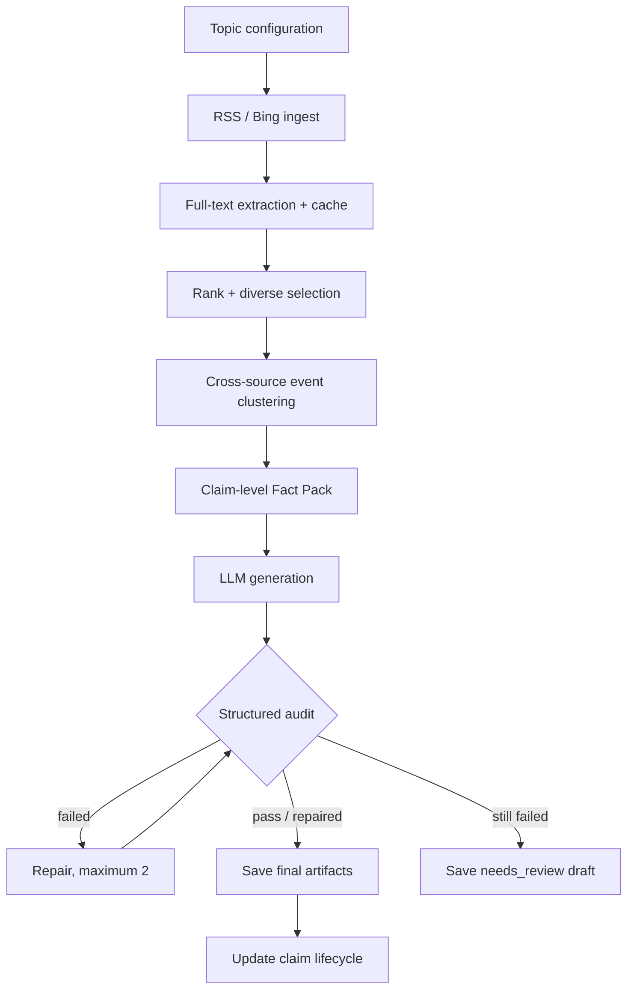

# NewsWeaver 产品需求说明

> 版本：v1.3
>
> 状态：Beta / 当前实现
>
> 更新日期：2026-08-12

## 1. 产品定位

NewsWeaver 是面向内容创作者、行业研究员和开发者的 evidence-first AI 新闻研究 Agent。它将多来源资讯转化为可追踪的事件、atomic claims、引用和跨期事实状态，而不是只生成不可核查的新闻摘要。

核心 provenance chain：

```text
source → article → event → atomic claim → citation → report sentence → memory
```

## 2. 当前入口

- CLI：主题、采集、预览、生成、记忆、趋势、模板、调度、发布素材和环境诊断。
- Web 工作台：模型配置、主题管理、素材体检、异步生成、证据侧栏、审计状态、编辑/版本恢复、局部改写和趋势卡片。
- 本地 JSON：配置、缓存、Fact Pack、聚类、审计、输出和趋势记忆。

项目不需要数据库。真实社交发布仍为模拟接口。

## 3. 主流程


```mermaid
flowchart TD
    Topic["Topic configuration"] --> Ingest["RSS / Bing ingest"]
    Ingest --> Extract["Full-text extraction + cache"]
    Extract --> Rank["Rank + diverse selection"]
    Rank --> Cluster["Cross-source event clustering"]
    Cluster --> Claims["Claim-level Fact Pack"]
    Claims --> Generate["LLM generation"]
    Generate --> Audit{"Structured audit"}
    Audit -- "failed" --> Repair["Repair, maximum 2"]
    Repair --> Audit
    Audit -- "pass / repaired" --> Save["Save final artifacts"]
    Save --> Memory["Update claim lifecycle"]
    Audit -- "still failed" --> Review["Save needs_review draft"]
```

硬约束：

```python
if not audit.passed:
    do_not_update_memory()
```

## 4. 功能需求

### 4.1 采集与正文

- RSS 为默认数据源，可选 Bing 和自定义 RSS。
- URL 去跟踪参数并去重；单页失败不影响整批任务。
- 正文提取保留完整文本，支持 timeout、retry、canonical URL、cache、User-Agent、fallback 和域名 adapter。
- `Article.metadata.extraction` 记录状态、方法、正文长度、缓存命中和错误。

### 4.2 排序与覆盖

- 排序基线为 relevance × freshness × source quality × novelty。
- 使用事件重复、来源重复和标题相似度做 diversity/MMR-style 贪心选择。
- 分项分数可检查，并保留替换 embedding ranker 的接口。

### 4.3 Event Cluster

- 同一媒体的不同事件不得因 source 相同而聚类。
- 不同媒体的同一事件应结合标题/正文关键词、实体和时间进入同一 cluster。
- cluster 必须包含稳定 `event_id`、articles、sources、entities、published range 和 representative title。
- 提供 `EventClusterer` 替换接口。

### 4.4 Claim-level Fact Pack

- 一篇文章可产生多条 atomic claims。
- 每条 claim 包含 `fact_id`、`article_id`、`source_span`、source/url/time、confidence、corroborating sources 和 `event_id`。
- 保留旧 `id` 与 `source_title` 字段。
- 数字、日期、金额、产品发布、政策变化和直接归因应成为可单独引用的 claim。

### 4.5 Generate / Audit / Repair

- 报告只能使用 Prompt 中给出的 Fact Pack。
- 所有关键事实和高风险信息必须引用准确 `[Fxxx]`。
- 审计结构化检查 citation ID、关键事实漏引、claim/support 对齐、Fact Pack 外事实和高风险证据。
- 失败后最多自动 repair 两次，每次都重新审计。
- 最终状态为 `pass`、`repaired` 或 `needs_review`。
- `needs_review` 可以保存，但不能写入记忆。

### 4.6 Claim lifecycle memory

保留 events/entities/metrics/judgments，并新增：

```text
new → corroborated / disputed / superseded / fulfilled / expired
```

趋势层需要回答：新增、确认、反驳、兑现和过时的信息分别是什么。

### 4.7 Eval

固定合成 fixture 用于回归比较 prompt/model/ranking/clustering 变化，指标至少包括：citation validity、unsupported claims、claim coverage、event duplication、important recall、source diversity、trend consistency、extraction success、tokens、estimated cost 和 latency。

合成 fixture 不应被宣传为真实世界 benchmark。

## 5. 公共接口与兼容性

- `newsweaver` CLI entry point 保持不变。
- `pipeline.py` 继续导出 `rank_articles`、`build_event_clusters`、`build_fact_pack`、`audit_report` 等旧入口。
- `extract_article(url) -> str` 保留；新增详细结果 API。
- Fact Pack v2 双写 `id`/`fact_id`。
- Memory schema v3 对缺失 claims 的旧记录按空列表处理。
- 安全收紧：没有显式通过审计的调用不得写结构化趋势记忆。

## 6. 非功能要求

- Python 3.10+；Windows/macOS/Linux。
- 无数据库和重量级 ML 基础设施。
- 网络请求具备超时、重试和降级。
- JSON 使用原子写入。
- GitHub Actions 运行 `ruff check .`、`pytest` 和 build。
- `pip install .` 与 `newsweaver --help` 必须可用。

## 7. 当前已知边界

- Citation support 目前是 lexical/entity/number baseline，高度抽象或跨语言转述可能需要人工复核。
- Event clustering 是确定性 baseline，尚未使用 embedding 或学习型 source reliability。
- Claim contradiction/fulfillment 是规则驱动 lifecycle，不是知识图谱或 NLI judge。
- 发布平台接口为模拟实现，不自动向外部平台发送内容。

## 8. 后续方向

- embedding-based event clustering；
- NLI-based citation verification；
- knowledge graph 与跨事件实体解析；
- multi-model judge；
- source reliability learning。
