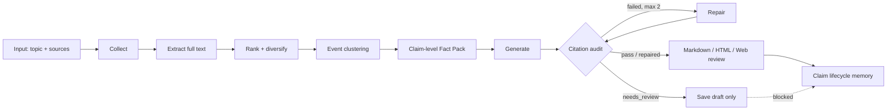

# NewsWeaver

> 一个 evidence-first 的 AI 新闻研究 Agent：采集 RSS/Bing 新闻，提取完整正文，跨来源聚类事件，生成 claim-level Fact Pack，在引用审计与自动修复通过后才更新趋势记忆。

NewsWeaver 的核心不是“让 LLM 总结几篇文章”，而是维护一条可追踪的证据链：

```text
source → article → event → atomic claim → citation → report sentence → memory
```

当前版本：`1.3.0`（Beta）。项目同时提供 CLI、本地 Web 工作台、定时任务、多格式导出和固定评估脚本。

## 工作流



生成闭环严格遵循：

```text
ingest
→ extract
→ rank/select
→ cluster events
→ extract atomic facts
→ generate
→ audit
→ repair (最多 2 次)
→ final audit
→ save
→ update memory（仅 audit pass）
```

## 主要能力

| 能力 | 当前实现 |
|---|---|
| Claim-level evidence | 一篇文章拆成多条 atomic claims；每条保留 `source_span` 与完整 provenance |
| 跨来源事件融合 | 基于标题/正文关键词、实体重叠和发布时间的确定性聚类；不使用媒体名作为 cluster key |
| 多来源佐证 | 同一事件中的相似 claims 会记录 `corroborating_sources` 并调整置信度 |
| 可验证生成 | 关键事实、数字、日期、金额、比例和直接归因必须引用 `[Fxxx]` |
| 引用闭环 | 校验 ID、缺失引用、citation/claim 支持关系、Fact Pack 外事实和高风险信息 |
| 安全记忆 | `needs_review` 草稿不会写入趋势记忆；通过审计的 claims 才能进入 lifecycle |
| Claim lifecycle | `new → corroborated / disputed / superseded / fulfilled / expired` |
| 信息覆盖排序 | BM25-style relevance × freshness × source quality × novelty，并加入事件/来源 diversity |
| 稳健正文提取 | 完整正文缓存、canonical URL、超时重试、并发抓取、readability/selector/body fallback、域名 adapter |
| 可复现评估 | 固定 fixture 衡量 citation、unsupported claims、event duplication、recall、diversity、extraction、cost 等 |

## 快速开始

要求 Python 3.10+。

```bash
git clone https://github.com/YinL04/NewsWeaver.git
cd NewsWeaver
pip install .
```

复制环境变量模板并填写 OpenAI-compatible API：

```bash
# macOS / Linux
cp .env.example .env

# Windows PowerShell
Copy-Item .env.example .env
```

```env
NEWSWEAVER_LLM_API_KEY=sk-your-api-key
NEWSWEAVER_LLM_BASE_URL=https://api.openai.com/v1
NEWSWEAVER_LLM_MODEL=gpt-4o-mini
```

先检查真实链路：

```bash
newsweaver doctor
```

### Web 工作台

```bash
newsweaver web
```

默认地址是 `http://127.0.0.1:8765`。Windows 也可以运行：

```powershell
.\run-web.ps1
```

Web 工作台提供：

- 模型与环境健康检查；
- 主题模板、关键词、必须包含词、自定义 RSS 和写作偏好；
- 素材体检、正文提取状态、质量门禁；
- 报告、证据侧栏、`source_span`、引用审计状态；
- `pass`、`repaired`、`needs_review` 三种结果；
- Markdown 编辑、版本保存/恢复和受 Fact Pack 约束的局部改写；
- claim lifecycle 趋势卡片。

### CLI

```bash
# 创建主题
newsweaver topic add --name "AI" --keywords "大模型,GPT,LLM" --sources "rss"

# 生成前预览（不调用 LLM）
newsweaver preview --topic "AI" --limit 10 --save

# 生成报告
newsweaver generate --topic "AI"

# 查看趋势与 claim 状态变化
newsweaver trend --topic "AI"

# 启动引导式菜单
newsweaver interactive
```

## Fact Pack 示例

Fact Pack schema v2 保留旧字段 `id` 和 `source_title`，同时加入 claim-level 字段：

```json
{
  "schema_version": 2,
  "fact_id": "F001",
  "id": "F001",
  "claim": "Company X announced Product Y on August 10.",
  "article_id": "A12AB34CD56EF",
  "source": "Reuters",
  "source_title": "Company X launches Product Y",
  "url": "https://example.com/story",
  "published_at": "2026-08-10T08:00:00+00:00",
  "source_span": "Company X announced Product Y on August 10.",
  "confidence": 0.9,
  "corroborating_sources": ["BBC"],
  "event_id": "E89ABCDEF0123"
}
```

`event_id` 与 `article_id` 都由内容/provenance 确定性生成。同一输入即使顺序变化，ID 仍然一致；cluster 成员变化时，事件内容哈希也会变化。

## 报告与审计示例

下面是格式示例，不是 benchmark 或真实新闻声明：

```markdown
Company X 在 8 月 10 日发布了 Product Y。[F001][F002]

这说明该公司正在加快产品节奏——这是分析判断，不是新增事实。
```

审计 sidecar 是结构化 JSON：

```json
{
  "schema_version": 2,
  "status": "repaired",
  "passed": true,
  "repair_attempts": 1,
  "checks": {
    "citation_ids_exist": {"passed": true, "count": 0, "items": []},
    "key_claims_cited": {"passed": true, "count": 0, "items": []},
    "citations_support_claims": {"passed": true, "count": 0, "items": []},
    "fact_pack_only": {"passed": true, "count": 0, "items": []},
    "high_risk_evidence": {"passed": true, "count": 0, "items": []}
  },
  "failure_reasons": []
}
```

如果两次 repair 后仍失败，报告仍会保存为 draft，但状态为 `needs_review`，且不会调用记忆更新。

## 事件聚类

默认 `DeterministicEventClusterer` 使用：

```text
title token Jaccard
+ content keyword overlap
+ named-entity overlap
+ publication-time proximity
```

cluster 记录：

- 稳定的 `event_id`；
- 完整 article provenance；
- 来源列表与实体列表；
- 发布时间范围；
- representative title；
- 兼容旧格式的 `cluster` 与 `titles` 字段。

`EventClusterer` 是可替换接口，未来可以接入 embedding clustering，而无需修改 Fact Pack 和生成调用链。

## 排序与正文提取

排序采用可替换的 `RankingStrategy`：

```text
final_score = relevance × freshness × source_quality × novelty × diversity
```

每篇文章的分项分数写入 `article.metadata["ranking"]`。最终贪心选择会降低同一事件和同一来源反复出现的权重，以有限文章覆盖更多独立信息。

正文提取通过 `extract_article_detailed()` 返回：

```json
{
  "status": "success",
  "method": "readability",
  "content_length": 8321,
  "cached": true,
  "canonical_url": "https://example.com/canonical",
  "attempts": 1
}
```

`extract_article(url) -> str` 仍然保留。完整正文写入本地 HTTP/extraction cache，不再固定截断为 2000 字；进入 LLM Prompt 时，Fact Pack 会按预算优先选择高风险信息并轮询不同事件。

## 趋势记忆

记忆文件位于 `~/.newsweaver/memory/<topic>.json`，schema v3 保留 events/entities/metrics/judgments，并新增 claims：

```json
{
  "claim_id": "C12AB34CD56EF",
  "claim": "Company X plans to launch Product Y in Q4.",
  "status": "fulfilled",
  "relationships": [
    {"type": "fulfills", "claim_id": "C98FE76DC54BA"}
  ]
}
```

趋势 API/CLI 可以回答：What is new、What was confirmed、What was contradicted、What prediction was fulfilled，以及哪些信息已经 superseded/expired。

## 输出文件

一次成功生成会在 `output/` 创建：

| 文件 | 内容 |
|---|---|
| `<topic>_<date>.md` | 报告或待复核 draft |
| `.html` | HTML 报告 |
| `.facts.json` | Claim-level Fact Pack |
| `.clusters.json` | 跨来源事件聚类 |
| `.quality.json` | 生成前素材质量门禁 |
| `.audit.json` | 审计、repair 次数和失败原因 |
| `.wechat.md` / `.email.md` | 渠道草稿 |
| `.publish.json` | 标题、摘要和封面 prompt 素材包 |

## 配置

配置优先级：`.env` 环境变量 > `~/.newsweaver/config.json` > 默认值。

| 环境变量 | 说明 |
|---|---|
| `NEWSWEAVER_LLM_API_KEY` | OpenAI-compatible API Key |
| `NEWSWEAVER_LLM_BASE_URL` | API Base URL |
| `NEWSWEAVER_LLM_MODEL` | 默认模型 |
| `NEWSWEAVER_BING_API_KEY` | 可选 Bing News API Key |

主题支持 `keywords`、`exclude_words`、`required_words`、`sources`、`language` 和 `preferences`。信源可以是 `rss`、`bing` 或 `rss:https://example.com/feed.xml`。

## 其他命令

```bash
newsweaver template list
newsweaver template add ai

newsweaver fetch --topic "AI" --limit 10 --days 3
newsweaver memory show --topic "AI"
newsweaver memory compact --topic "AI" --force

newsweaver schedule add --topic "AI" --cadence daily --time 09:00
newsweaver schedule run --once

newsweaver publish --topic "AI" --platform linkedin --kit
```

社交平台发布仍是模拟接口；`--kit` 只读取本地发布素材，不会发送外部内容。

## Eval 与开发

安装开发依赖：

```bash
pip install -e ".[dev]"
```

运行质量检查：

```bash
pytest
ruff check .
python -m build
python scripts/evaluate.py
```

固定 fixture 位于 `tests/fixtures/eval/`。它是用于算法回归的合成样例，不代表真实世界质量或性能 benchmark。评估输出包括：

- citation validity；
- unsupported claim rate 与 claim coverage；
- duplicate event rate 与 important event recall；
- source diversity 与 trend consistency；
- extraction success rate；
- token usage、estimated generation cost 和 recorded latency。

GitHub Actions 会在 Python 3.10 与 3.12 上运行 lint、test 和 build。

## 项目结构

```text
src/newsweaver/
├── cli.py / commands.py       # CLI 与命令调用链
├── webapp.py / web/           # 本地 Web 工作台
├── pipeline.py                # 向后兼容的公共流水线 API
├── clustering.py              # EventClusterer 与确定性 baseline
├── evidence.py                # Claim Fact Pack、audit、memory gate
├── ranking.py                 # 模块化排序与 diversity
├── extractor.py               # 完整正文、cache、adapter、metadata
├── generator.py               # generate → audit → repair → save → memory
├── evaluation.py              # 固定 eval 指标
├── fetcher/                   # RSS / Bing adapters
├── llm/                       # OpenAI-compatible client 与 prompts
└── memory/                    # JSON store、claim lifecycle、周聚合

scripts/evaluate.py
tests/fixtures/eval/
tests/
```

## 兼容性与限制

- CLI 命令和 entry point 没有 breaking change。
- Fact Pack v2 双写 `id`/`fact_id`，旧消费者可继续读取 `id`。
- MemoryStore 会把加载后的记忆标记为 schema v3；旧 recent/long_term 条目无需一次性迁移，缺失 `claims` 时按空列表处理。
- `add_structured_recent_memory()` 现在要求显式传入通过审计的结果；这是防止记忆污染的有意安全收紧。
- 当前 citation support 是确定性的 lexical/entity/number baseline，不等同于 NLI；跨语言或高度抽象的改写可能被标记为 `needs_review`。
- 当前事件聚类不使用向量数据库，复杂的跨日跟进事件可能分成多个 cluster。

## License

MIT
